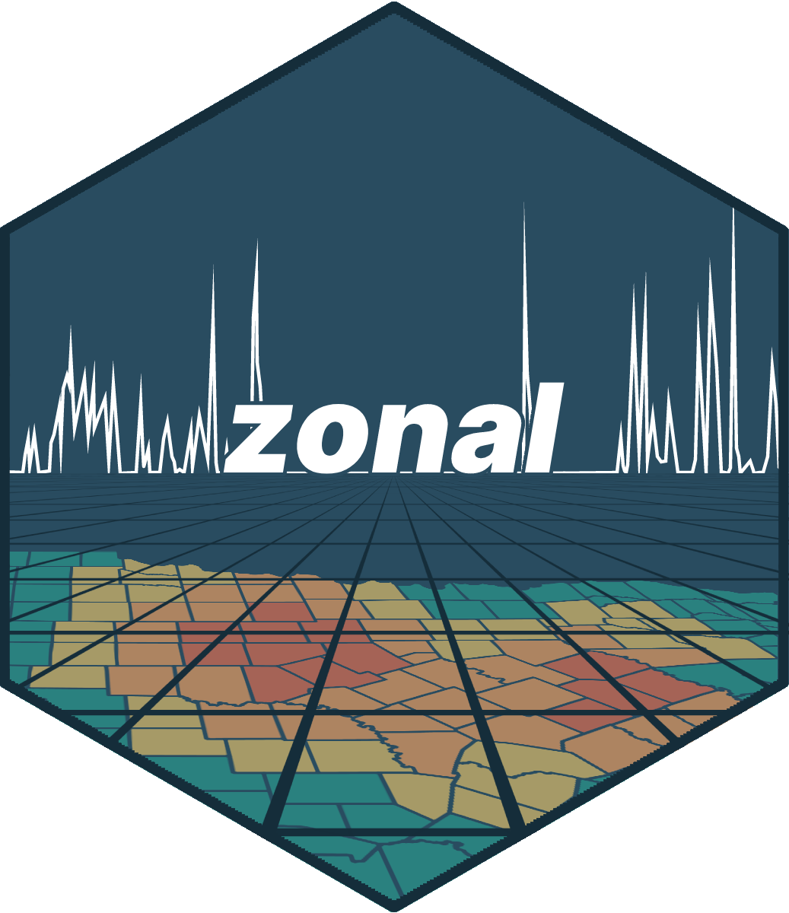
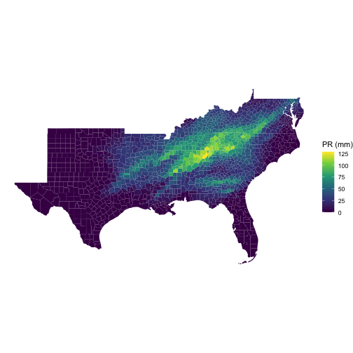
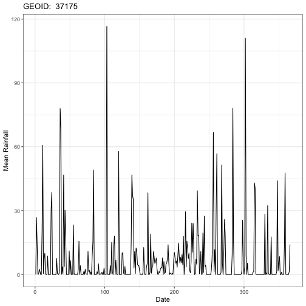
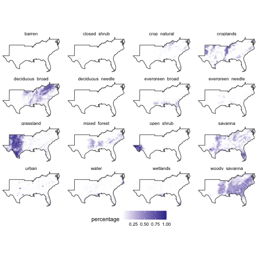
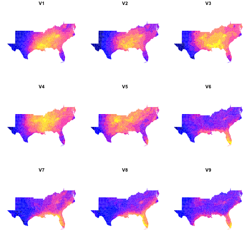

<!-- README.md is generated from README.Rmd. Please edit that file -->


# zonal 

<!-- badges: start -->
[](https://github.com/mikejohnson51/zonal/actions/workflows/R-CMD-check.yaml)
[](https://www.repostatus.org/#active)
[](https://lifecycle.r-lib.org/articles/stages.html#experimental)
[](#)
[](https://choosealicense.com/licenses/mit/)
[](https://github.com/mikejohnson51/zonal/actions/workflows/pkgdown.yaml)
<!-- badges: end -->

`zonal` is an active package for intersecting vector aggregation units with large gridded data. While there are many libraries that seek to tackle this problem (see credits) we needed a library that could handle large gridded extents storing categorical and continuous data, with multiple time layers with both many small vector units and few large units.

We also seek to segment the creation of grid weights from the zonal execution so that the same weight map can be applied across different products with the same structure.

## Installation

You can install the development version of `zonal` from [GitHub](https://github.com/) with:

``` r
# install.packages("remotes")
remotes::install_github("mikejohnson51/zonal")
```
## Example

This is a basic example that takes a NetCDF file containing a 4km grid for the continental USA and daily precipitation for the year 1979 (365 layers). Our goal is to subset this file to the southern USA, and compute daily county level averages. The result is a daily rainfall average for each county.


```r
library(zonal)
library(dplyr)
library(tidyr)
library(ggplot2)

file <- 'to_build/pr_2020.nc'
AOI  <- AOI::aoi_get(state = "south", county = "all") 

system.time({
  pr_zone     = execute_zonal(file, geom = AOI, ID = "geoid", join = FALSE)
})
#>    user  system elapsed 
#>  10.689   2.157  13.011

# PET zone: Counties, time slices/ID
dim(pr_zone)
#> [1] 1421  367
```

### Daily maximum mean rainfall in a county?


```r
x = merge(AOI, pr_zone, by  ="geoid")
# Plot Day with the maximum single county max rainfall.
n = colnames(pr_zone)[which(pr_zone[,-1] == max(pr_zone[,-1]), arr.ind = TRUE)[2] + 1]


ggplot(data = x) + 
  geom_sf(aes(fill = get(n)), color = NA) + 
  scale_fill_viridis_c() + 
  theme_void() + 
  labs(fill = "PR (mm)")
```


### Daily maximum rainfall in the south?


```r
# Plot Day with the maximum county wide rainfall
n2 = names(which.max(colSums(dplyr::select(pr_zone, -geoid))))

terra::plot(terra::rast(file)[[103]])
```


```r

ggplot() + 
  geom_sf(data = x, aes(fill = get(n2)), color = NA) + 
  scale_fill_viridis_c() + 
  theme_void() + 
  labs(fill = "PR (mm)")
```



### Timeseries of county with maximum annual rainfall


```r
data = pr_zone %>% 
  slice_max(rowSums(select(., -geoid))) %>% 
  pivot_longer(-geoid, names_to = "day", values_to = "prcp") %>% 
  mutate(day = as.numeric(gsub("V","", day)))

head(data)
#> # A tibble: 6 × 3
#>   geoid   day   prcp
#>   <chr> <dbl>  <dbl>
#> 1 37175     1  0    
#> 2 37175     2 26.7  
#> 3 37175     3 13.6  
#> 4 37175     4  0.234
#> 5 37175     5  0.144
#> 6 37175     6  2.52
```



# 1km Landcover Grid (Categorical)

One of the largest limitations of existing utilities is the ability to handle categorical data. Here we show an example for a 1km grid storing land cover data from MODIS. This grid was creating by mos acing 19 MODIS tiles covering CONUS.


```r
file = 'to_build/2019-01-01.tif'
rcl  = read.csv("to_build/modis_lc.csv") %>% 
  dplyr::select(from = Class, to = short)

system.time({
  lc = execute_zonal_cat(file, AOI, "geoid", rcl = rcl)
})
#>    user  system elapsed 
#>   6.529   0.596   7.353
```



## Zonal and climateR

Here lets so a quick intergation of the AOI/climateR/zonal family. The goal is to find monthly mean normal (1981-2010) rainfall for all USA counies in the south.

We can do this by (1) defining the southern `AOI`, (2) quering normal rainfall data from `climateR` (3) passing the returned data through `zonal`:


```r
system.time({
  AOI = AOI::aoi_get(state = "south", county = 'all')
  tt  = climateR::getTerraClimNormals(AOI, "prcp")
  out = zonal::execute_zonal(file = tt[[1]], 
                             geom = AOI, 
                             ID = "geoid", 
                             join = TRUE)
})
#> Spherical geometry (s2) switched off
#> Spherical geometry (s2) switched on
#>    user  system elapsed 
#>   5.211   0.710   7.361

plot(out[paste0("V", 1:12)], border = NA)
```




----

## Getting involved

1. Code style should attempt to follow the tidyverse style guide.
2. Please avoid adding significant new dependencies without a documented reason why.
3. Please attempt to describe what you want to do prior to contributing by submitting an issue.
4. Please follow the typical github fork - pull-request workflow.
5. Make sure you use roxygen and run Check before contributing.

----

## Open source licensing info
1. [TERMS](TERMS.md)
2. [LICENSE](LICENSE)

----

## Credits and references

Similar R packages:

1. [exactexactr](https://github.com/isciences/exactextractr)
2. [intersectr](https://github.com/USGS-R/intersectr)
3. [areal](https://github.com/slu-openGIS/areal)
4. [sf](https://github.com/r-spatial/sf)
5. [raster](https://github.com/rspatial/raster)

**Logo Artwork:** [Justin Singh-Mohudpur](https://www.justinsingh.me/about/)
