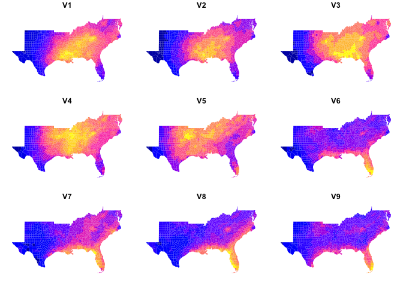
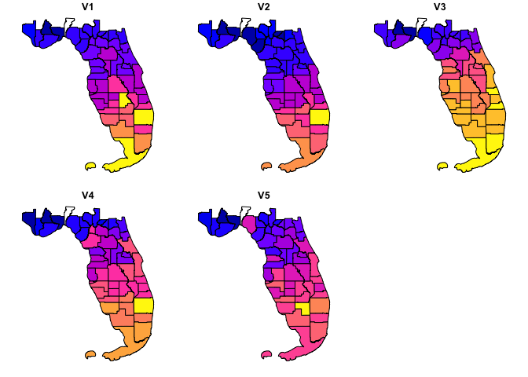

<!-- README.md is generated from README.Rmd. Please edit that file -->

# zonal 

<!-- badges: start -->

[](https://github.com/mikejohnson51/zonal/actions/workflows/R-CMD-check.yaml)
[](https://www.repostatus.org/#active)
[](https://lifecycle.r-lib.org/articles/stages.html#experimental)
[](#)
[](https://choosealicense.com/licenses/mit/)
[](https://github.com/mikejohnson51/zonal/actions/workflows/pkgdown.yaml)
<!-- badges: end -->

`zonal` is an active package for intersecting vector aggregation units
with large gridded data. While there are many libraries that seek to
tackle this problem (see credits) we needed a library that could handle
large gridded extents storing categorical and continuous data, with
multiple time layers with both many small vector units and few large
units.

(**Udapte: March 15, 2022**): With the addition of `.eagerLoad`
following this
[issue](https://github.com/isciences/exactextractr/issues/62) in
`exactextractr` by [Dan Baston](https://github.com/dbaston) much of the
speed gained by using `zonal` over pure `exactextractr` has been either
matched - or - surpassed using `exactextract` on its own.

`zonal` is being updated to reflect this and is moving closer to a thin
wrapper of that excellent package. When the time comes that it is not
longer a thin wrapper, and just reuse of exactextractr, we will move the
utility functions to `opendap.catlog` and kill this package.

The plan for that would be to add a `summary.function` argument to `dap`
that would allow for extracted gridded data to be summarized
efficiently.

There are still three main element that, for now, make it worth keeping
alive.

1.  Some additional “named” summary types (categorical, and geometric
    mean). The first may be mostly resolved with
    [this](https://github.com/isciences/exactextractr/issues/75))
2.  The ability to export weight maps with ‘relative’ and ‘global’ cell
    IDs for reuse with ongoing hydrologic modeling work at NOAA OWP.

## Installation

You can install the development version of `zonal` from
[GitHub](https://github.com/) with:

``` r
# install.packages("remotes")
remotes::install_github("mikejohnson51/zonal")
```

## Example

This is a basic example that takes a NetCDF file containing a 4km grid
for the continental USA and daily precipitation for the year 1979 (365
layers). Our goal is to subset this file to the southern USA, and
compute daily county level averages. The result is a daily rainfall
average for each county.

``` r
library(zonal)

file <- "to_build/pr_2020.nc"
AOI <- AOI::aoi_get(state = "south", county = "all")

system.time({
  pr_zone <- execute_zonal(file, geom = AOI, ID = "fip_code", join = FALSE)
})
#>    user  system elapsed 
#>   9.900   1.337  11.502

# PET zone: Counties, time slices/ID
dim(pr_zone)
#> [1] 1421  367
```

### Daily maximum mean rainfall in a county?

``` r
x <- merge(AOI, pr_zone, by = "fip_code")
# Plot Day with the maximum single county max rainfall.
n <- colnames(pr_zone)[which(pr_zone[, -1] == max(pr_zone[, -1]), arr.ind = TRUE)[2] + 1]

ggplot(data = x) +
  geom_sf(aes(fill = get(n)), color = NA) +
  scale_fill_viridis_c() +
  theme_void() +
  labs(fill = "PR (mm)")
```


### Daily maximum rainfall in the south?

``` r
# Plot Day with the maximum county wide rainfall
n2 <- names(which.max(colSums(select(pr_zone, -fip_code))))

ggplot() +
  geom_sf(data = x, aes(fill = get(n2)), color = NA) +
  scale_fill_viridis_c() +
  theme_void() +
  labs(fill = "PR (mm)")
```


### Timeseries of county with maximum annual rainfall

``` r
data <- pr_zone %>%
  slice_max(rowSums(select(., -fip_code))) %>%
  pivot_longer(-fip_code, names_to = "day", values_to = "prcp") %>%
  mutate(day = as.numeric(gsub("V", "", day)))

head(data)
#> # A tibble: 6 × 3
#>   fip_code   day   prcp
#>   <chr>    <dbl>  <dbl>
#> 1 37175        1  0    
#> 2 37175        2 26.8  
#> 3 37175        3 13.7  
#> 4 37175        4  0.244
#> 5 37175        5  0.144
#> 6 37175        6  2.55
```


# 1km Landcover Grid (Categorical)

One of the largest limitations of existing utilities is the ability to
handle categorical data. Here we show an example for a 1km grid storing
land cover data from MODIS. This grid was creating by mos acing 19 MODIS
tiles covering CONUS. The summary function for this categorical
frequency is “freq”.

``` r
file <- "to_build/2019-01-01.tif"

rcl <- read.csv("to_build/modis_lc.csv") %>%
  dplyr::select(from = Class, to = short)

system.time({
  lc <- execute_zonal(file, geom = AOI, ID = "fip_code", FUN = "freq", rcl = rcl)
})
#>    user  system elapsed 
#>   7.812   0.668   8.657
```


## Zonal and opendap.catalog

Here lets look at a quick intergation of the
`AOI`/`opendap.catalog`/`zonal` family. The goal is to find monthly
mean, normal (1981-2010), rainfall for all USA counties in the south.

``` r
AOI <- AOI::aoi_get(state = "FL", county = "all")

system.time({
  file <- opendap.catalog::dap(
    URL = "https://cida.usgs.gov/thredds/dodsC/bcsd_obs",
    AOI = AOI,
    startDate = "1995-01-01",
    verbose = FALSE,
    varname  = "pr"
  ) |>
    execute_zonal(geom = AOI, ID = "fip_code")
})
#>    user  system elapsed 
#>   1.418   0.084   2.583

plot(file[grep("pr", names(file), value = TRUE)], border = NA)
```



``` r
library(opendap.catalog)

(cat <- search("PET_500m")[1, ])
#> # A tibble: 1 × 16
#>   id         grid_id URL   tiled variable varname long_name units model ensemble
#>   <chr>      <chr>   <chr> <chr> <chr>    <chr>   <chr>     <chr> <chr> <chr>   
#> 1 MOD16A2.0… <NA>    http… XY_m… <NA>     PET_50… MODIS Gr… kg/m… <NA>  <NA>    
#> # … with 6 more variables: scenario <chr>, T_name <chr>, duration <chr>,
#> #   interval <chr>, nT <int>, rank <dbl>

AOI <- AOI::aoi_get(state = "FL", county = "all")

system.time({
  dap <- opendap.catalog::dap(
    catolog = cat,
    AOI = AOI,
    startDate = "2020-01-01",
    endDate   = "2020-01-31",
    verbose = FALSE
  ) |>
    execute_zonal(geom = AOI, FUN = "max", ID = "fip_code")
})
#>    user  system elapsed 
#>   2.717   0.862   7.282


plot(dap[grep("V", names(dap), value = TRUE)])
```



``` r
library(opendap.catalog)

dap2 <- function(URL = NULL, catolog = NULL, AOI = NULL, startDate = NULL,
                 endDate = NULL, varname = NULL, verbose = TRUE, summarize.function = NULL) {
  dap <- dap_crop(
    URL = URL, catolog = catolog, AOI = AOI,
    startDate = startDate, endDate = endDate, varname = varname,
    verbose = verbose
  )

  dap <- dap_get(dap)

  if (!is.null(summarize.function)) {
    dap <- execute_zonal(dap, AOI, FUN = summarize.function)
  }
}


(cat <- search("PET_500m")[1, ])
#> # A tibble: 1 × 16
#>   id         grid_id URL   tiled variable varname long_name units model ensemble
#>   <chr>      <chr>   <chr> <chr> <chr>    <chr>   <chr>     <chr> <chr> <chr>   
#> 1 MOD16A2.0… <NA>    http… XY_m… <NA>     PET_50… MODIS Gr… kg/m… <NA>  <NA>    
#> # … with 6 more variables: scenario <chr>, T_name <chr>, duration <chr>,
#> #   interval <chr>, nT <int>, rank <dbl>

AOI <- AOI::aoi_get(state = "FL", county = "all")


system.time({
  dap <- opendap.catalog::dap(
    catolog = cat,
    AOI = AOI,
    startDate = "2020-01-01",
    endDate = "2020-01-31",
    verbose = FALSE
  ) |>
    execute_zonal(geom = AOI, FUN = "max", ID = "fip_code")
})
#>    user  system elapsed 
#>   2.921   0.856   5.936


plot(dap[grep("V", names(dap), value = TRUE)])
```


------------------------------------------------------------------------

## Getting involved

1.  Code style should attempt to follow the tidyverse style guide.
2.  Please avoid adding significant new dependencies without a
    documented reason why.
3.  Please attempt to describe what you want to do prior to contributing
    by submitting an issue.
4.  Please follow the typical github fork - pull-request workflow.
5.  Make sure you use roxygen and run Check before contributing.

------------------------------------------------------------------------

## Open source licensing info

1.  [TERMS](TERMS.md)
2.  [LICENSE](LICENSE)

------------------------------------------------------------------------

## Credits and references

Similar R packages:

1.  [exactexactr](https://github.com/isciences/exactextractr)
2.  [sf](https://github.com/r-spatial/sf)
3.  [terra](https://github.com/rspatial/raster)

**Logo Artwork:** [Justin
Singh-Mohudpur](https://www.justinsingh.me/about/)
