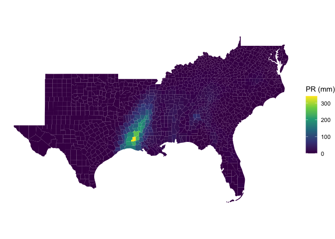
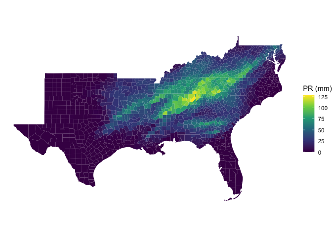

<!-- README.md is generated from README.Rmd. Please edit that file -->

# zonal 

<!-- badges: start -->

[](https://github.com/mikejohnson51/zonal/actions/workflows/R-CMD-check.yaml)
[](https://www.repostatus.org/#active)
[](https://lifecycle.r-lib.org/articles/stages.html#experimental)
[](#)
[](https://choosealicense.com/licenses/mit/)
<!-- badges: end -->

`zonal` is an active package for intersecting vector aggregation units
with large gridded data. While there are many libraries that seek to
tackle this problem (see credits) we needed a library that could handle
large gridded extents storing categorical and continuous data, with
multiple time layers with both many small vector units and few large
units.

We also seek to segment the creation of grid weights from the zonal
execution so that the same weight map can be applied across different
products with the same structure.

## Installation

You can install the development version of `zonal` from
[GitHub](https://github.com/) with:

``` r
# install.packages("remotes")
remotes::install_github("mikejohnson51/zonal")
```

## Example

This is a basic example that takes a NetCDF file containing a 4km grid
for the continental USA and daily precipitation for the year 1979 (365
layers). Our goal is to subset this file to the southern USA, and
compute daily county level averages. The result is a daily rainfall
average for each county.

``` r
library(zonal)
library(sf)
library(dplyr)
library(ggplot2)

file <- '/Users/mjohnson/Downloads/pr_1979.nc'
AOI  <- AOI::aoi_get(state = "south", county = "all") 

system.time({
  # Build Weight Grid
  w        = weighting_grid(file, AOI, "geoid")
  # Intersect
  pr_zone = execute_zonal(file, w)
})
#>    user  system elapsed 
#>  12.025   2.347  10.190

# PET zone: Counties, time slices/ID
dim(pr_zone)
#> [1] 1421  366
```

### Daily maximum mean rainfall in a county?

``` r
# Plot Day with the maximum single county max rainfall.
n = colnames(pr_zone)[which(pr_zone[,-1] == max(pr_zone[,-1]), arr.ind = TRUE)[2] + 1]
plot(merge(AOI, pr_zone)[n], border = NA)
```



### Daily maximum rainfall in the south?

``` r
# Plot Day with the maximum county wide rainfall
n2 = names(which.max(colSums(select(pr_zone, -geoid))))
plot(merge(AOI, pr_zone)[n2], border = NA)
```



### Timeseries of conuty with maximum annual rainfall

``` r
data = pr_zone %>% 
  slice_max(rowSums(select(., -geoid))) %>% 
  tidyr::pivot_longer(-geoid, names_to = "date", values_to = "prcp") 

head(data)
#> # A tibble: 6 x 3
#>   geoid date        prcp
#>   <chr> <chr>      <dbl>
#> 1 37175 1979-01-01 48.3 
#> 2 37175 1979-01-02 19.1 
#> 3 37175 1979-01-03  0   
#> 4 37175 1979-01-04  0   
#> 5 37175 1979-01-05  1.96
#> 6 37175 1979-01-06 12.9
```


# 1km Landcover Grid (Categorical)

One of the largest limitations of existing utilities is the ability to
handle categorical data. Here we show an example for a 1km grid storing
land cover data from MODIS. This grid was creating by mosacing 19 MODIS
tiles covering CONUS.

``` r
file = '/Users/mjohnson/Downloads/MCD12Q1.006.nc'
rcl = read.csv("inst/modis_lc.csv") %>% 
  dplyr::select(from = Class, to = short)

system.time({
  # Build Weight Grid
  w  = weighting_grid(file, AOI, "geoid")
  # Intersect, and relclassify
  lc = execute_zonal_cat(file, w, rcl)
})
#>    user  system elapsed 
#>   6.841   0.720   4.950
```


------------------------------------------------------------------------

## Getting involved

1.  Code style should attempt to follow the tidyverse style guide.
2.  Please avoid adding significant new dependencies without a
    documented reason why.
3.  Please attempt to describe what you want to do prior to contributing
    by submitting an issue.
4.  Please follow the typical github fork - pull-request workflow.
5.  Make sure you use roxygen and run Check before contributing.

------------------------------------------------------------------------

## Open source licensing info

1.  [TERMS](TERMS.md)
2.  [LICENSE](LICENSE)

------------------------------------------------------------------------

## Credits and references

Similar R packages:

1.  [exactexactr](https://github.com/isciences/exactextractr)
2.  [intersectr](https://github.com/USGS-R/intersectr)
3.  [areal](https://github.com/slu-openGIS/areal)
4.  [sf](https://github.com/r-spatial/sf)
5.  [raster](https://github.com/rspatial/raster)

**Logo Artwork:** [Justin
Singh-Mohudpur](https://www.justinsingh.me/about/)
