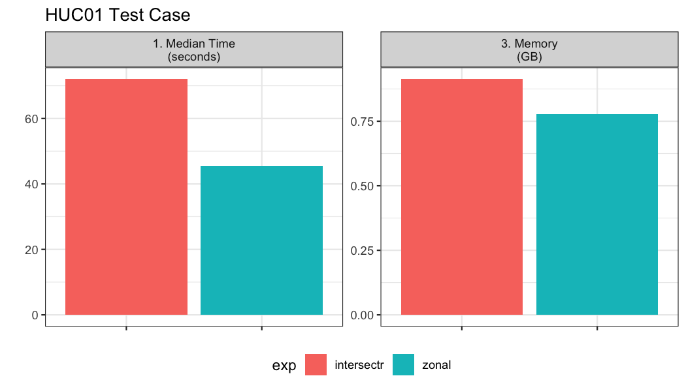
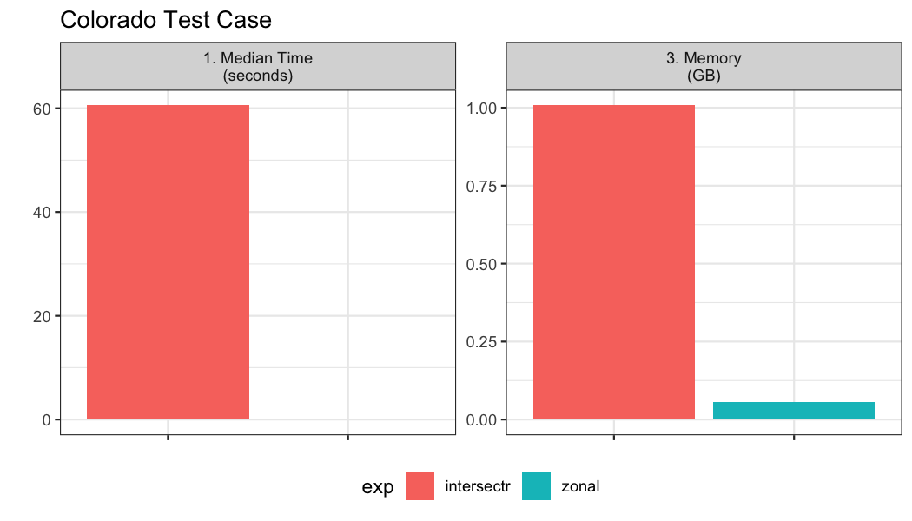

## Methods 

The first step in computing zonal statistics are the need to compute a weight map that can be used to reallocate the gridded data with respect to the percent overlapping each cell. There are two primary packages that tackle this which include `intersectr` (which uses `areal` as a back-end) and `zonal` which uses `exactextractr`. 


From the `exactextractr` documentation: "_Results from `exactextractr` are more accurate than other methods because raster pixels that are partially covered by polygons are considered. The significance of partial coverage increases for polygons that are small or irregularly shaped." 

The same premise applies to `intersectr`/`areal`.

## So, what is a weight grid? 

A weight grid is unique to the aggregate units and grid its build from. It contains columns documenting the X and Y indexes of each grid cell along with the grid id. The X,Y are realtive to the entire grid, while the grid ID is relative to subsetwithin the bounding domain of the aggregations unit(s). Additionally the `w` stores the percent overlap between the grid cell and the aggregation unit identified by the ID column which is speified in the `build`weighting_grid` function. An example is shown below:


### Option 1: Intersectr: 

Setting up the data for a `intersectr` weights map requires (1) computing a vector representation of the grid and (2) intersecting this grid with the aggregation units  to determine the percent overlap or "coverage fraction". Below the workflow from the `intersectr` docs is wrapped in a function that requires a NetCDF file path, a `sf` geometry set, an ID variable from the geometries, and the variable to extract from the grid.


```r
library(intersectr)
library(ncmeta)
library(RNetCDF)

intersectr_weights = function(file, geom, ID, var){
  nc_coord_vars <- nc_coord_var(file)
  variable_name <- var
  nc_coord_vars <- filter(nc_coord_vars, variable == variable_name)
  
  nc       <- open.nc(file)
  X_coords <- var.get.nc(nc, nc_coord_vars$X, unpack = TRUE)
  Y_coords <- var.get.nc(nc, nc_coord_vars$Y, unpack = TRUE)
  
  nc_prj <- nc_gm_to_prj(nc_grid_mapping_atts(file))
    
  cell_geometry = create_cell_geometry(X_coords = X_coords,
                         Y_coords = Y_coords,
                         prj = nc_prj,
                         geom = geom, 
                         buffer_dist = 0.1, # Degrees
                         regularize = TRUE)
    
  data_source_cells <- st_sf(dplyr::select(cell_geometry, grid_ids))
  target_polygons   <- st_sf(dplyr::select(geom, !!ID))
  st_agr(data_source_cells) <- "constant"
  st_agr(target_polygons)   <- "constant"
    
  calculate_area_intersection_weights(
      data_source_cells,
      target_polygons, allow_lonlat = TRUE)
}
```

### Option 2: Zonal

In `zonal` grid weights are calculated using `exactextractr` as the back-end. The key function is `weighting_grid`.


```r
library(zonal)
```

## Use Cases

Here two motivating use cases are shown to compare the efficiency of these approaches. The first covers a large area but has many small aggregation units. The second covers a large area but has a few large polygon aggregation units. Each of these pose a unique set of demands with respect to how the calculation is performed. 

## Grid
The gridded data and aggregate units we are working with can be seen below and downloaded from [here](https://www.northwestknowledge.net/metdata/data/pet_2020.nc):


```r
file = 'pet_2020.nc'
(s = terra::rast(file))
```

```
## class       : SpatRaster 
## dimensions  : 585, 1386, 366  (nrow, ncol, nlyr)
## resolution  : 0.04167, 0.04167  (x, y)
## extent      : -124.8, -67.04, 25.05, 49.42  (xmin, xmax, ymin, ymax)
## coord. ref. : lon/lat WGS 84 (EPSG:4326) 
## source      : pet_2020.nc 
## varname     : potential_evapotranspiration (pet) 
## names       : poten~43829, poten~43830, poten~43831, poten~43832, poten~43833, poten~43834, ... 
## unit        :          mm,          mm,          mm,          mm,          mm,          mm, ...
```

Looking at the grid we can see in consists of 810810 grid cells each with a 0.0417 meter by 0.0417 meter resolution. Additionally, there are 366 unique time slices in the NetCDF file.

## Example 01: Many small aggregation units

Here, we look at an example with ~20,000 watersheds along the east coast.


```r
geom <- st_make_valid(read_sf('hydrofabric.gpkg', "catchments"))

paint(geom)
```

```
## sf [18041, 4] 
## active geometry column: geom (POLYGON)
## crs: 5070 (NAD83 / Conus Albers)
## crs unit: metre 
## ID        chr cat-1 cat-2 cat-4 cat-5 cat-6 cat-7
## area_sqkm dbl 12.457576 267.083595 8.319214 9.278138 60.577~
## toID      chr nex-2 nex-3 nex-5 nex-6 nex-7 nex-8
## geom      sfc POLY 2,024B POLY 9,064B POLY 1,656B POLY 1,81~
```
  
In total we have 18,041 aggregation units to summarize over the 366 time steps.


```r
bnch <- bench::mark(
  iterations = 1, check = FALSE, time_unit = "s",
  intersectr = intersectr_weights(file, geom, "ID", "potential_evapotranspiration"),
  zonal      = weighting_grid(s, geom, "ID")
)
```



## Example 02: Few, large aggregation units

Here, we test aggregation the 4km gridded data to 64 counties in Colorado.


```r
colorado  = AOI::aoi_get(state = "CO", county = "all")
paint(colorado)
```

```
## sf [64, 13] 
## active geometry column: geometry (MULTIPOLYGON)
## crs: 4269 (NAD83)
## crs unit: degree 
## statefp           chr 08 08 08 08 08 08
## countyfp          chr 035 095 039 014 037 053
## countyns          chr 00198133 00198163 00198136 01945881 0~
## affgeoid          chr 0500000US08035 0500000US08095 0500000~
## geoid             chr 08035 08095 08039 08014 08037 08053
## name              chr Douglas Phillips Elbert Broomfield Ea~
## lsad              chr 06 06 06 06 06 06
## aland             dbl 2176272717 1781724973 4793658887 8547~
## awater            dbl 6752511 301808 442148 1411781 1884999~
## state_name        chr Colorado Colorado Colorado Colorado C~
## state_abbr        chr CO CO CO CO CO CO
## jurisdiction_type chr state state state state state state
## geometry          sfc MPOLY 872B MPOLY 824B MPOLY 824B MPOL~
```
  
In total we have 64 aggregation units to summarize over the 366 time steps.


```r
bnch2 <- bench::mark(
  iterations = 1, check = FALSE, time_unit = "s",
  intersectr = intersectr_weights(file, colorado, "name", "potential_evapotranspiration"),
  zonal      = weighting_grid(file, colorado, "name")
)
```




