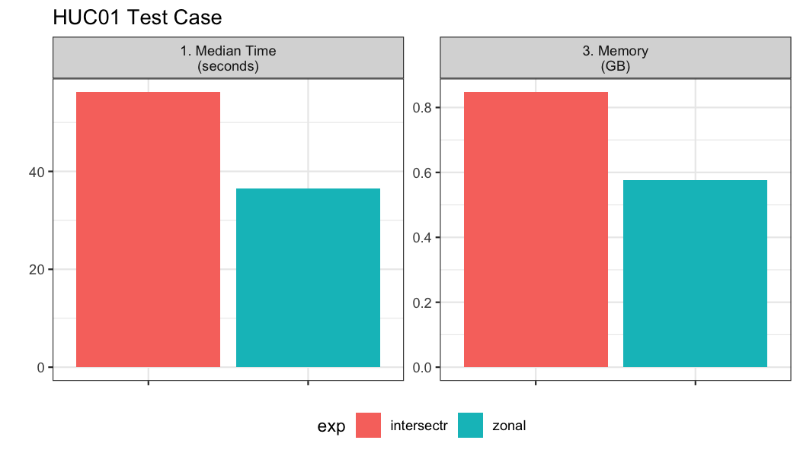
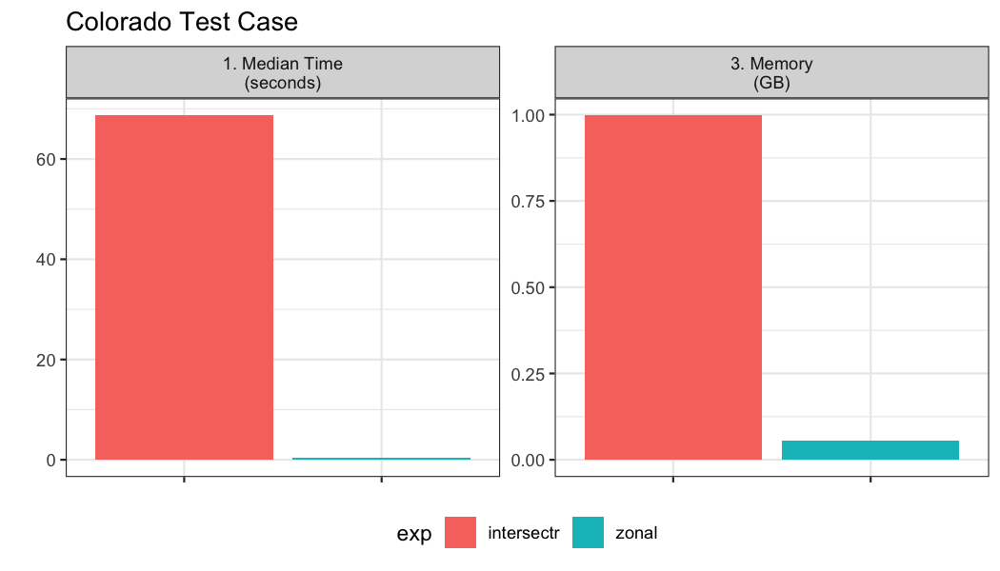

## Methods 

The first step in computing zonal statistics are the need to compute a weight map that can be used to reallocate the gridded data with respect to the percent overlapping each cell. There are two primary packages that tackle this which include `intersectr` (which uses `areal` as a back-end) and `zonal` which uses `exactextractr`. 

### Option 1: Intersectr: 

Setting up the data for a `intersectr` weights map requires (1) computing a vector representation of the grid and (2) intersecting this grid with the aggregation units  to determine the percent overlap or "coverage fraction". Below the workflow from the `intersectr` docs is wrapped in a function that requires a NetCDF file path, a `sf` geometry set, an ID variable from the geometries, and the variable to extract from the grid.


```r
library(intersectr)
library(ncmeta)
library(RNetCDF)

intersectr_weights = function(file, geom, ID, var){
  nc_coord_vars <- nc_coord_var(file)
  variable_name <- var
  nc_coord_vars <- filter(nc_coord_vars, variable == variable_name)
  
  nc       <- open.nc(file)
  X_coords <- var.get.nc(nc, nc_coord_vars$X, unpack = TRUE)
  Y_coords <- var.get.nc(nc, nc_coord_vars$Y, unpack = TRUE)
  
  nc_prj <- nc_gm_to_prj(nc_grid_mapping_atts(file))
    
  cell_geometry = create_cell_geometry(X_coords = X_coords,
                         Y_coords = Y_coords,
                         prj = nc_prj,
                         geom = geom, 
                         buffer_dist = 0.1, # Degrees
                         regularize = TRUE)
    
  data_source_cells <- st_sf(dplyr::select(cell_geometry, grid_ids))
  target_polygons   <- st_sf(dplyr::select(geom, !!ID))
  st_agr(data_source_cells) <- "constant"
  st_agr(target_polygons)   <- "constant"
    
  calculate_area_intersection_weights(
      data_source_cells,
      target_polygons, allow_lonlat = TRUE)
}
```

### Option 2: Zonal

In `zonal` grid weights are calculated using `exactextractr` as the back-end. The key function needed is `weighting_grid`.


```r
library(zonal)
```

## Use Cases

Here two motivating use cases are shown to compare the efficiency of these two approaches. The first covers a large area but has many small aggregation units. The second also covers a large area but has a few large polygon aggregation units. Each of these poses a unique set of demands with respect to how the calculation is performed. 

## Grid
The gridded data and aggregate units we are working with can be seen below and downloaded from [here](https://www.northwestknowledge.net/metdata/data/pet_2020.nc):


```r
file = 'pet_2020.nc'
(s = terra::rast(file))
```

```
## class       : SpatRaster 
## dimensions  : 585, 1386, 366  (nrow, ncol, nlyr)
## resolution  : 0.04167, 0.04167  (x, y)
## extent      : -124.8, -67.04, 25.05, 49.42  (xmin, xmax, ymin, ymax)
## coord. ref. : +proj=longlat +datum=WGS84 +no_defs 
## source      : pet_2020.nc 
## varname     : potential_evapotranspiration (pet) 
## names       : poten~43829, poten~43830, poten~43831, poten~43832, poten~43833, poten~43834, ... 
## unit        :          mm,          mm,          mm,          mm,          mm,          mm, ...
```

Looking at the grid we can see in consists of 810810 grid cells each with a 0.0417 meter by 0.0417 meter resolution. Additionally, there are 366 unique time slices in the NetCDF file.

## Example 01: Many small aggregation units

Here, we look at an example with ~20,000 watersheds along the east coast.


```r
geom <- st_make_valid(read_sf('ngen_01a-4.gpkg', "catchments"))

glimpse(geom)
```

```
## Rows: 19,700
## Columns: 3
## $ comid    <dbl> 4289595, 4290057, 4287059, 4287061, 429264…
## $ areasqkm <dbl> 12.271, 4.061, 2.806, 6.787, 18.157, 27.86…
## $ geom     <MULTIPOLYGON [m]> MULTIPOLYGON (((1976295 290..…
```
  
In total we have 19,700 aggregation units to summarize over the 366 time steps.


```r
bnch <- bench::mark(
  iterations = 1, check = FALSE, time_unit = "s",
  intersectr = intersectr_weights(file, geom, "comid", "potential_evapotranspiration"),
  zonal      = weighting_grid(s, geom, "comid")
)
```



## Example 02: Few, large aggregation units

Here, we test aggregation the 4km gridded data to 64 counties in Colorado.


```r
colorado  = AOI::aoi_get(state = "CO", county = "all")
glimpse(colorado)
```

```
## Rows: 64
## Columns: 13
## $ statefp           <chr> "08", "08", "08", "08", "08", "08"…
## $ countyfp          <chr> "035", "095", "039", "014", "037",…
## $ countyns          <chr> "00198133", "00198163", "00198136"…
## $ affgeoid          <chr> "0500000US08035", "0500000US08095"…
## $ geoid             <chr> "08035", "08095", "08039", "08014"…
## $ name              <chr> "Douglas", "Phillips", "Elbert", "…
## $ lsad              <chr> "06", "06", "06", "06", "06", "06"…
## $ aland             <dbl> 2176272717, 1781724973, 4793658887…
## $ awater            <dbl> 6752511, 301808, 442148, 1411781, …
## $ state_name        <chr> "Colorado", "Colorado", "Colorado"…
## $ state_abbr        <chr> "CO", "CO", "CO", "CO", "CO", "CO"…
## $ jurisdiction_type <chr> "state", "state", "state", "state"…
## $ geometry          <MULTIPOLYGON [°]> MULTIPOLYGON (((-105.…
```
  
In total we have 64 aggregation units to summarize over the 366 time steps.


```r
bnch2 <- bench::mark(
  iterations = 1, check = FALSE, time_unit = "s",
  intersectr = intersectr_weights(file, colorado, "name", "potential_evapotranspiration"),
  zonal      = weighting_grid(file, colorado, "name")
)
```



Notably the `intersectr` approach, based on vector intersections, is unable to scale well when the aggregation units are large.

## So, what is a weight grid? 

A weight grid is unique to the aggregate units and grid its build from. It contains columns documenting the X and Y indexes of each grid cell along with the grid id. The X,Y are realtive to the entire grid, while the grid ID is relative to subsetwithin the bounding domain of the aggregations unit(s). Additionally the `w` stores the percent overlap between the grid cell and the aggregation unit identified by the ID column which is speified in the `build`weighting_grid` function. An example is shown below:


```r
zonal      = zonal::weighting_grid(file, colorado, "name")
head(zonal)
```

```
##      name   Y   X grid_id      w
## 1: Moffat 203 378       1 0.2725
## 2: Moffat 203 379       2 0.9153
## 3: Moffat 203 380       3 0.9146
## 4: Moffat 203 381       4 0.9139
## 5: Moffat 203 382       5 0.9132
## 6: Moffat 203 383       6 0.9125
```
