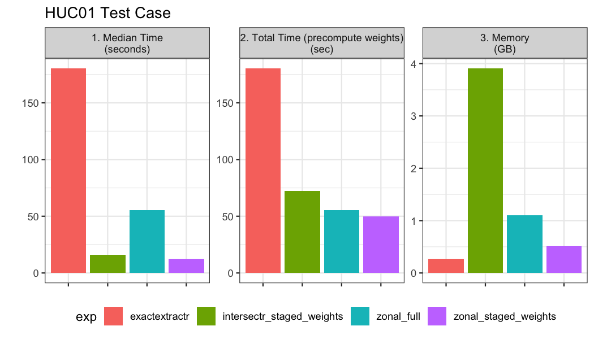
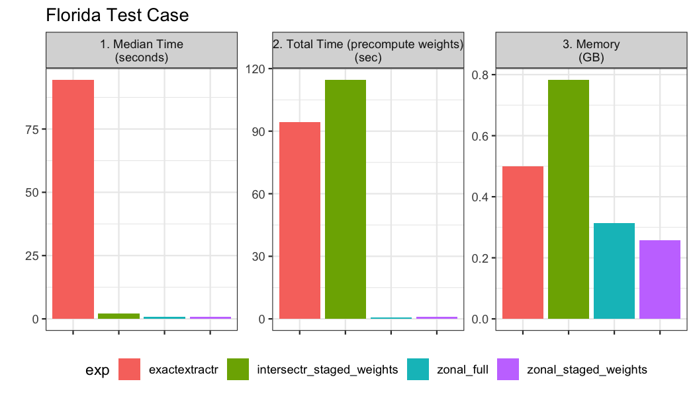

With a weight grid, zonal metrics can be computed. The four primary approaches use slightly different processes:

  1. `exactextractr` leverages C libraries and an in memory raster and sf object. It works polygon-by-polygon to compute coverage's and the weight table is computed within the function.
  2. `intersectr` utilizes NetCDF filepath and calculates all polygons timestep-by-timestep using` data.table`. A weight grid must be supplied.
  3. `zonal` works from NetCDF or tif filepath and calculates all polygons and all time simultaneously using `data.table`. A weight grid must also be supplied.

The performance and comparison of these three approaches are shown below when the domain is large, and when (A) there a many thousands of polygons, and (B) when there a a few large polygon aggregation units.

### Option 1: Intersectr: 

The `intersectr` workflow for defining inputs for `execute_intersection` are wrapping into a prep function below:


```r
intersectr_prep = function(file, geom, ID, variable){
  nc_coord_vars <- nc_coord_var(file)
  nc_coord_vars <- filter(nc_coord_vars, variable == !!variable)
  
  nc       <- open.nc(file)
  X_coords <- var.get.nc(nc, nc_coord_vars$X, unpack = TRUE)
  Y_coords <- var.get.nc(nc, nc_coord_vars$Y, unpack = TRUE)
  
  nc_prj <- nc_gm_to_prj(nc_grid_mapping_atts(file))
    
  cell_geometry = create_cell_geometry(X_coords = X_coords,
                         Y_coords = Y_coords,
                         prj = nc_prj,
                         geom = geom, 
                         buffer_dist = 0.1, # Degrees
                         regularize = TRUE)
    
  data_source_cells <- st_sf(dplyr::select(cell_geometry, grid_ids))
  target_polygons   <- st_sf(dplyr::select(geom, !!ID))
  st_agr(data_source_cells) <- "constant"
  st_agr(target_polygons)   <- "constant"

  area_weights = calculate_area_intersection_weights(data_source_cells, target_polygons, allow_lonlat = TRUE)
  
  return(list(grid = cell_geometry, w = area_weights, x = nc_coord_vars$X, y = nc_coord_vars$Y, t = nc_coord_vars$T))
}
```

### Option 2: exactextract: 

The `exacextract` workflow for computing aggregate means for a raster stack are wrapped below:


```r
exactrextract_process = function(file, geom, ID){
  R.utils::withTimeout(
    exactextractr::exact_extract(raster::stack(file), 
                                 geom, 
                                 stack_apply = TRUE, 
                                 fun = "mean", 
                                 append_cols = ID,
                                 progress = FALSE),
  timeout = 180, onTimeout = "silent")
}
```

**Spoiler Alert**: This method can take an extremely long time when the polygon count is very high. As such, we are limiting the execution time to 180 seconds (three minutes). If a benchmark time indicates the process takes 180 seconds, it means the process was killed and not completed.

### Option 3: zonal: 

The `zonal` workflow for building a weight grid and executing the areal averages can be executed with `execute_zonal`.


```r
library(zonal)
```

## Grid
The gridded data and aggregate units we are working with can be seen below:


```r
file = 'pet_2020.nc'
(s = terra::rast(file))
```

```
## class       : SpatRaster 
## dimensions  : 585, 1386, 366  (nrow, ncol, nlyr)
## resolution  : 0.04167, 0.04167  (x, y)
## extent      : -124.8, -67.04, 25.05, 49.42  (xmin, xmax, ymin, ymax)
## coord. ref. : lon/lat WGS 84 (EPSG:4326) 
## source      : pet_2020.nc 
## varname     : potential_evapotranspiration (pet) 
## names       : poten~43829, poten~43830, poten~43831, poten~43832, poten~43833, poten~43834, ... 
## unit        :          mm,          mm,          mm,          mm,          mm,          mm, ...
```

Looking at the grid we can see in consists of 810810 grid cells each with a 0.0417 meter by 0.0417 meter resolution. Additionally, there are 366 unique time slices in the NetCDF file.

## Example 1: HUC01

Our first example uses a hydrofabric developed for the Northeast USA.


```r
geom <- read_sf('hydrofabric.gpkg', "catchments")
paint(geom)
```

```
## sf [18041, 4] 
## active geometry column: geom (POLYGON)
## crs: 5070 (NAD83 / Conus Albers)
## crs unit: metre 
## ID        chr cat-1 cat-2 cat-4 cat-5 cat-6 cat-7
## area_sqkm dbl 12.457576 267.083595 8.319214 9.278138 60.577~
## toID      chr nex-2 nex-3 nex-5 nex-6 nex-7 nex-8
## geom      sfc POLY 2,024B POLY 9,064B POLY 1,656B POLY 1,81~
```

In total we have 18,041 aggregation units to summarize over the 366 time steps. Both zonal and intersectr are designed to precompute a weight grid. Therefore we time how long it takes to do this using each method:


```r
int_time_huc01 = system.time({
  intersectr_input = intersectr_prep(file, 
                                     geom, 
                                     ID = "ID", 
                                     variable = 'potential_evapotranspiration')
})

zonal_time_huc01 = system.time({
  zonal_w = weighting_grid(file, 
                           geom, 
                           ID = "ID")
})
```

Next, we benchmark the time it takes to do the following:
- run the `intersectr` workflow with precomputed weights
- run the `exactextractr` workflow
- run the `zonal` workflow 
- run the `zonal` workflow with precomputed weights


```r
huc01_bnch <- bench::mark(
  iterations = 1, check = FALSE, time_unit = 's',
  intersectr_staged_weights = execute_intersection(nc_file = file,
                               variable_name = 'potential_evapotranspiration',
                               intersection_weights = intersectr_input$w,
                               cell_geometry = intersectr_input$grid, 
                               x_var = intersectr_input$x,
                               y_var = intersectr_input$y,
                               t_var = intersectr_input$t, 
                               start_datetime = NULL, 
                               end_datetime = NULL),
  exactextractr            = exactrextract_process(file, geom, "ID"),
  zonal_full               = execute_zonal(file, geom, "ID"),
  zonal_staged_weights     = execute_zonal(file, w = zonal_w)
)
```



Overall when the polygon count is very high (~20,000), the zonal aproach with precomputed weights and non precomputed weights performs the best. Precomputing the weights save a significant amount of memory in the process and ~4 seconds in total run time. These timings suggest that 20 years of daily GridMet data could be computed for the ~20,000 catchments in about 11 minutes (~30 seconds * 20 year + ~15 seconds). The `intersectr` approach requires way more memory despite the precomputation of weights and takes about 3 times as long as zonal. Lastly the `exactextract` methods timed out at the upper limit of 180 seconds we prescribed. 

## Example 02: Florida Counties

Our second example looks at the timings for an aggregation over a large area with a few  aggregation units. The gridded data is the same as example 1, and the aggregate units can be seen below:


```r
(florida <- AOI::aoi_get(state = "FL", county = "all"))
```

```
## Simple feature collection with 67 features and 12 fields
## Geometry type: MULTIPOLYGON
## Dimension:     XY
## Bounding box:  xmin: -87.63 ymin: 24.5 xmax: -80.03 ymax: 31
## Geodetic CRS:  NAD83
## First 10 features:
##     statefp countyfp countyns       affgeoid geoid      name lsad      aland    awater state_name state_abbr jurisdiction_type                       geometry
## 9        12      027 00294452 0500000US12027 12027    DeSoto   06 1649978040   6247257    Florida         FL             state MULTIPOLYGON (((-82.06 27.2...
## 97       12      109 00308371 0500000US12109 12109 St. Johns   06 1555793097 571962797    Florida         FL             state MULTIPOLYGON (((-81.68 30.1...
## 143      12      049 00295746 0500000US12049 12049    Hardee   06 1651867900   1439673    Florida         FL             state MULTIPOLYGON (((-82.05 27.6...
## 285      12      125 00306913 0500000US12125 12125     Union   06  630807237  16049079    Florida         FL             state MULTIPOLYGON (((-82.58 29.9...
## 398      12      005 00295738 0500000US12005 12005       Bay   06 1964402055 711451660    Florida         FL             state MULTIPOLYGON (((-85.99 30.3...
## 403      12      039 00306918 0500000US12039 12039   Gadsden   06 1337193228  31687293    Florida         FL             state MULTIPOLYGON (((-84.93 30.6...
## 404      12      073 00306916 0500000US12073 12073      Leon   06 1727171525  90453994    Florida         FL             state MULTIPOLYGON (((-84.72 30.3...
##  [ reached 'max' / getOption("max.print") -- omitted 3 rows ]
```

The same functions and timing from example 1 are computed:


```r
int_time_fl = system.time({
  intersectr_input_florida = intersectr_prep(file, florida, ID = "geoid", variable = 'potential_evapotranspiration')
})

zonal_time_fl = system.time({
  zonal_w_florida = weighting_grid(file, florida, ID = "geoid")
})
```


```r
fl_bnch <- bench::mark(
  iterations = 1, check = FALSE, time_unit = 's',
  intersectr_staged_weights = execute_intersection(nc_file = file,
                               variable_name = 'potential_evapotranspiration',
                               intersection_weights = intersectr_input_florida$w,
                               cell_geometry = intersectr_input_florida$grid, 
                               x_var = intersectr_input_florida$x,
                               y_var = intersectr_input_florida$y,
                               t_var = intersectr_input_florida$t, 
                               start_datetime = NULL, 
                               end_datetime = NULL),
  exactextractr            = exactrextract_process(file, florida, "geoid"),
  zonal_full               = execute_zonal(file, florida, "geoid"),
  zonal_staged_weights     = execute_zonal(file, w = zonal_w_florida)
)
```


