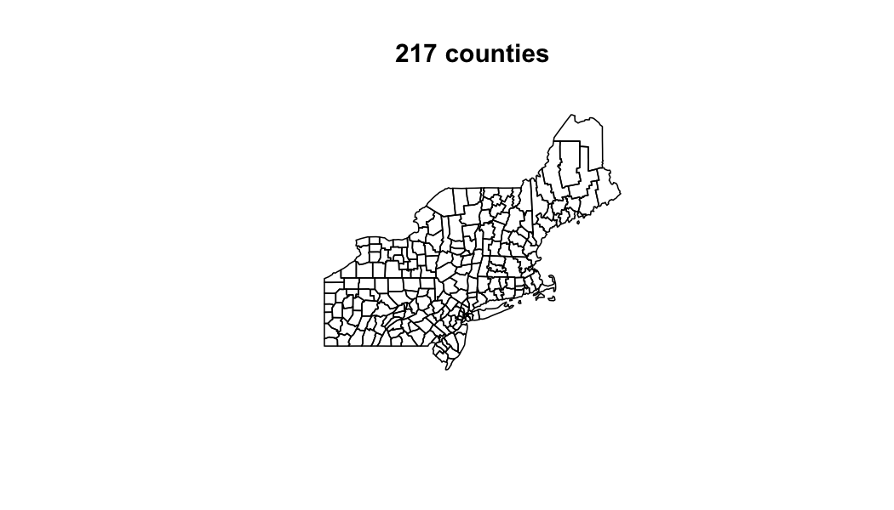
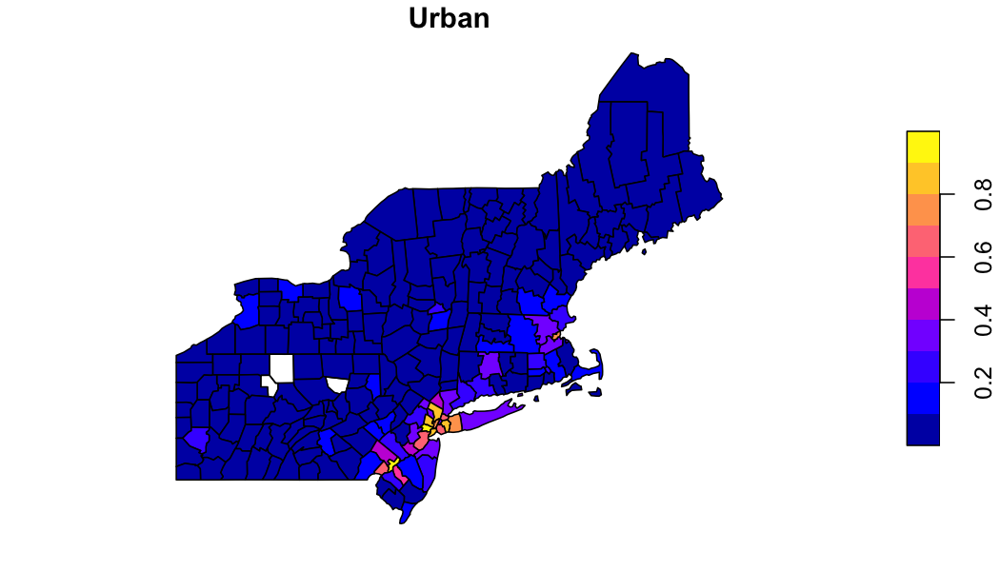
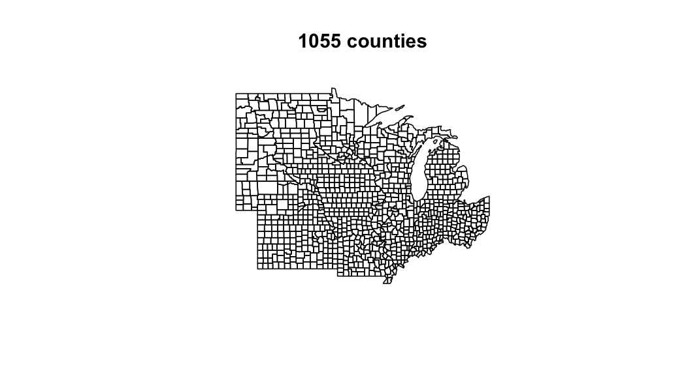
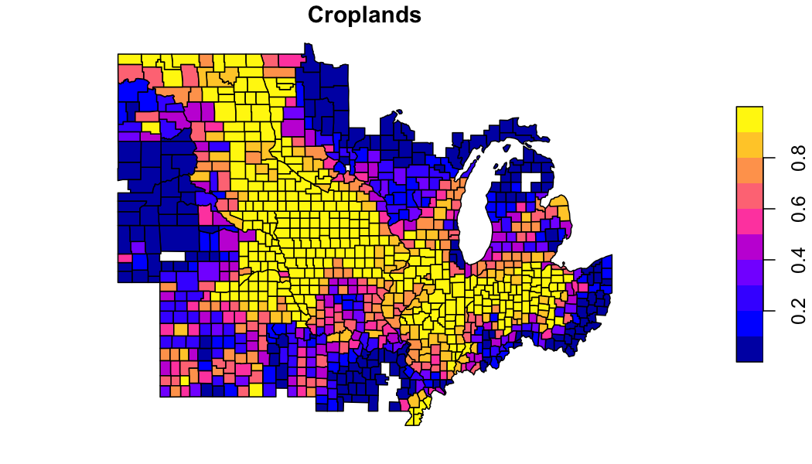
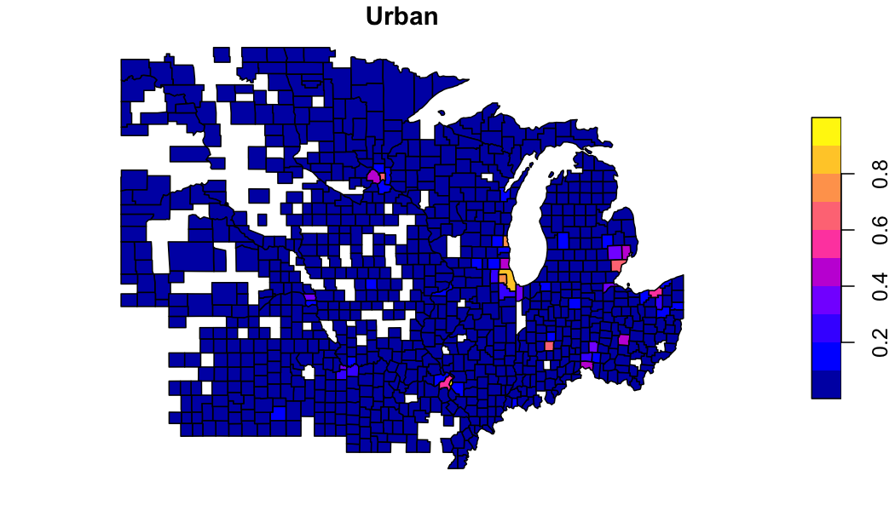
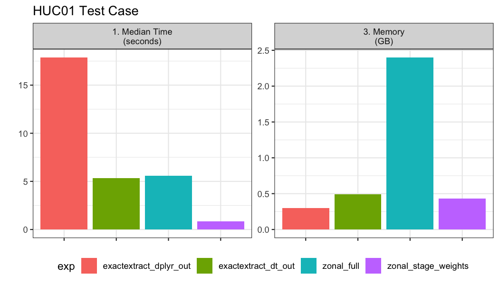

```r
library(zonal)
library(ggplot2)
library(dplyr)
library(sf)
```

In `zonal` categorical data is handled with `execute_zonal_cat` which computes the relative proportion of a numeric class in each aggregation unit. In the following we illustrate its use using a mosaiced 1km grid containing MODIS 2019 land cover.

### Grid

```r
file = '2019-01-01.tif'
(r = terra::rast(file))
```

```
## class       : SpatRaster 
## dimensions  : 2896, 4616, 1  (nrow, ncol, nlyr)
## resolution  : 1000, 1000  (x, y)
## extent      : -2357000, 2259000, 277000, 3173000  (xmin, xmax, ymin, ymax)
## coord. ref. : +proj=aea +lat_0=23 +lon_0=-96 +lat_1=29.5 +lat_2=45.5 +x_0=0 +y_0=0 +datum=NAD27 +units=m +no_defs 
## source      : 2019-01-01.tif 
## name        : Land_Cover_Type_1
```

Looking at the grid we can see in consists of 13367936 grid cells each with a 1000 meter by 1000 meter resolution. Additionally, there are 18 unique values in the grid (17 landcover and one nodata value).

### Example 1: Basic Use

First, we want to identify the percent of each land cover within each county in the USA Northeast. Doing this follows the same process as all `zonal` workflows and requires (1) identifiying the aggregation units, (2) building a weight grid and (3) running the intersection.

#### Define aggreation units


```r
AOI  = AOI::aoi_get(state = "Northeast", county = "all")
plot(AOI$geometry, main = paste(nrow(AOI), "counties"))
```



#### Build a weight grid and execute intersection


```r
system.time({
  lc = execute_zonal_cat(file, geom = AOI, "geoid")
})
```

```
##    user  system elapsed 
##   2.776   1.226   4.139
```

```r
glimpse(lc)
```

```
## Rows: 1,998
## Columns: 3
## $ geoid      <chr> "23003", "23003", "23003", "23003", "23003", "23003", "2…
## $ value      <dbl> 8, 13, 10, 4, 5, 9, 12, 14, 17, 1, 11, 4, 5, 8, 10, 1, 5…
## $ percentage <dbl> 0.1333440, 0.0012883, 0.0137853, 0.1660485, 0.6205781, 0…
```

#### Exploring the data


```r
to_plot = lc %>% 
  tidyr::pivot_wider(names_from = value, values_from = percentage) %>% 
  right_join(AOI) %>% 
  st_as_sf()
```


```r
plot(to_plot['12'], main = "Croplands")
```


```r
plot(to_plot['13'], main = "Urban")
```



### Example 2: Definining Classes 

While the above works, callinging on fields by there numeric ID is prone to error. Instead, this example shows how a reclassification table can be supplied to modify the column headings of the output table.

#### Define Aggregation Units


```r
AOI  = AOI::aoi_get(state = "North Central", county = "all")
plot(AOI$geometry, main = paste(nrow(AOI), "counties"))
```



#### Define Reclass Table

A reclassification table tells us what each numeric value represents in a categorical raster. Below, we use a CSV file to define this mapping. The schema used is that one column must be named "from" - this is the exisiting data values, and one column must be named "to" - this is the desired column headings.


```r
rcl = read.csv("modis_lc.csv") %>% 
  dplyr::select(from = Class, to = short)

head(rcl)
```

```
##   from               to
## 1    1 evergreen_needle
## 2    2  evergreen_broad
## 3    3 deciduous_needle
## 4    4  deciduous_broad
## 5    5     mixed_forest
## 6    6     closed_shrub
```

#### Build a weight grid and execute intersection


```r
system.time({
  lc = execute_zonal_cat(file, geom = AOI, ID = "geoid", rcl = rcl)
})
```

```
##    user  system elapsed 
##   6.404   2.013   8.822
```

```r
glimpse(lc)
```

```
## Rows: 7,103
## Columns: 3
## $ geoid      <chr> "27077", "27077", "27077", "27077", "27077", "27077", "2…
## $ value      <chr> "woody_savanna", "deciduous_broad", "grassland", "mixed_…
## $ percentage <dbl> 0.355295, 0.095976, 0.045633, 0.141788, 0.015364, 0.2559…
```

#### Explore the data


```r
midwest = merge(AOI, lc)
plot(filter(midwest, value == 'croplands')['percentage'], main = "Croplands")
```




```r
plot(filter(midwest, value == 'urban')['percentage'], main = "Urban")
```



### Further user-based aggregates

In the MODIS land cover scheme there are 5 classes loosly representing forest. If wanted to aggregate these to a single forest class, we can use the output `zonal` table.


```r
forest = filter(lc, grepl('forest|broad|needle', value)) %>% 
  group_by(geoid) %>% 
  summarise(forest = sum(percentage)) %>% 
  right_join(AOI) %>% 
  sf::st_as_sf()

plot(forest['forest'], main = "Forest")
```


## Compare with exactextractr

From the `exactectractr` vignettes there is an example to compute class statisitcs using `dplyr`. Here we compare that appraoch, to one supplimented with `data.table`, to `zonal` with pre-compted weights, and to a single `zonal` execution.


```r
library(raster)
library(exactextractr)
library(data.table)

# exactextract with dplyr
exactextract_dplyr = function(file, AOI) {
  exact_extract(raster(file), AOI, function(df) {
  df %>%
    mutate(frac_total = coverage_fraction / sum(coverage_fraction)) %>%
    group_by(geoid, value) %>%
    summarise(freq = sum(frac_total), .groups = "keep")
}, summarize_df = TRUE, include_cols = "geoid", progress = FALSE)
}

# exactextract with data.table
exactextract_dt = function(file, AOI){
  exact_extract(raster(file), AOI, function(df) {
    dt = setDT(df)
    dt$frac_total = dt$coverage_fraction / sum(dt$coverage_fraction)
    dt[, .(freq = sum(frac_total, na.rm = TRUE)), by = .(value)]
  }, summarize_df = TRUE, include_cols = "geoid", progress = FALSE)
}

# pre-compute weights 
w = weighting_grid(file, AOI, "name")

bnch <- bench::mark(
  iterations = 1, check = FALSE, time_unit = "s",
  exactextract_dplyr_out  = exactextract_dplyr(file, AOI),
  exactextract_dt_out     = exactextract_dt(file, AOI),
  zonal_full              = execute_zonal_cat(file, AOI, "geoid"),
  zonal_stage_weights     = execute_zonal_cat(file, w = w)
)
```


