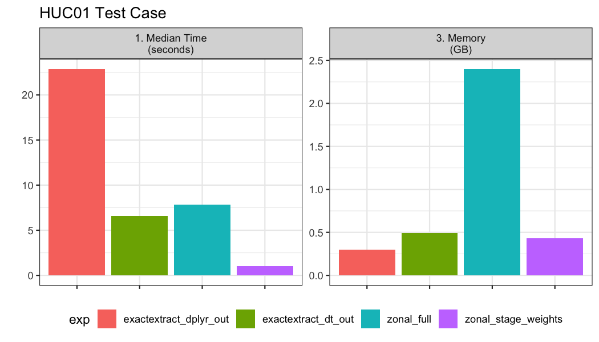

```r
library(zonal)
library(ggplot2)
library(dplyr)
library(sf)
library(tidyr)
library(terra)
library(paint)
```

In `zonal` categorical data is handled with `execute_zonal_cat` which computes the relative proportion of a numeric class in each aggregation unit. In the following we illustrate its use using a mosaiced 1km grid containing MODIS 2019 land cover.

### Grid

```r
file = '2019-01-01.tif'
(r = rast(file))
```

```
## class       : SpatRaster 
## dimensions  : 2896, 4616, 1  (nrow, ncol, nlyr)
## resolution  : 1000, 1000  (x, y)
## extent      : -2357000, 2259000, 277000, 3173000  (xmin, xmax, ymin, ymax)
## coord. ref. : +proj=aea +lat_0=23 +lon_0=-96 +lat_1=29.5 +lat_2=45.5 +x_0=0 +y_0=0 +datum=NAD27 +units=m +no_defs 
## source      : 2019-01-01.tif 
## name        : Land_Cover_Type_1
```

Looking at the grid we can see in consists of 13367936 grid cells each with a 1000 meter by 1000 meter resolution. Additionally, there are 18 unique values in the grid (17 land cover and one _nodata_ value).

### Example 1: Basic Use

First, we want to identify the percent of each land cover within each county in the USA Northeast. Doing this follows the same process as all `zonal` workflows and requires (1) identifying the aggregation units, (2) building a weight grid and (3) running the intersection.

#### Define aggreation units


```r
AOI  = AOI::aoi_get(state = "Northeast", county = "all")
plot(AOI$geometry, main = paste(nrow(AOI), "counties"))
```


#### Build a weight grid and execute intersection


```r
system.time({
  lc = execute_zonal_cat(file, geom = AOI, ID = "geoid")
})
```

```
##    user  system elapsed 
##   0.966   0.314   1.296
```

```r
paint(lc)
```

```
## data.table [1998, 3] 
## geoid      chr 23003 23003 23003 23003 23003 23003
## value      dbl 8 13 10 4 5 9
## percentage dbl 0.133344 0.001288 0.013785 0.166048 0.620578~
```

#### Exploring the data


```r
to_plot = lc %>% 
  pivot_wider(names_from = value, values_from = percentage) %>% 
  right_join(AOI) %>% 
  st_as_sf() 

paint(to_plot)
```

```
## sf [217, 27] 
## active geometry column: geometry (MULTIPOLYGON)
## crs: 4269 (NAD83)
## crs unit: degree 
## geoid             chr 23003 23021 23019 23025 23029 23009
## 8                 dbl 0.133344 0.039851 0.169854 0.090216 0~
## 13                dbl 0.001288 0.001497 0.010607 0.002855 0~
## 10                dbl 0.013785 0.001063 0.006269 0.001752 0~
## 4                 dbl 0.166048 0.206227 0.148822 0.357611 0~
## 5                 dbl 0.620578 0.6885 0.628569 0.526434 0.6~
## 9                 dbl 0.002005 0.000704 0.000325 0.000283 0~
## 12                dbl 0.040466 NA 0.000541 0.00008 0.000131~
## 14                dbl 0.015611 NA 0.001082 0.00066 NA NA
## 17                dbl 0.005139 0.040602 0.023043 0.011352 0~
## 1                 dbl 0.001408 0.0135 0.010113 0.0075 0.083~
## 11                dbl 0.000327 0.008056 0.000775 0.001257 0~
## 3                 dbl NA NA NA NA NA 0.000181
## 16                dbl NA NA NA NA NA NA
## 7                 dbl NA NA NA NA NA NA
## statefp           chr 23 23 23 23 23 23
## countyfp          chr 003 021 019 025 029 009
## countyns          chr 00581287 00581296 00581295 00581298 0~
## affgeoid          chr 0500000US23003 0500000US23021 0500000~
## name              chr Aroostook Piscataquis Penobscot Somer~
## lsad              chr 06 06 06 06 06 06
## aland             dbl 17278038268 10258683458 8798667306 10~
## awater            dbl 405253178 1080382095 414015520 437895~
## state_name        chr Maine Maine Maine Maine Maine Maine
## state_abbr        chr ME ME ME ME ME ME
## jurisdiction_type chr state state state state state state
## geometry          sfc MPOLY 1,560B MPOLY 1,128B MPOLY 1,384~
```


```r
plot(to_plot['12'], main = "Croplands")
```


```r
plot(to_plot['13'], main = "Urban")
```


### Example 2: Definining Classes 

While the above works, calling on fields by their numeric ID is prone to error. Instead, this example shows how a reclassification table can be supplied to modify the column headings of the output table.

#### Define Aggregation Units


```r
AOI  = AOI::aoi_get(state = "West", county = "all") %>% 
  filter(!state_abbr %in% c("AK", "HI"))
plot(AOI$geometry, main = paste(nrow(AOI), "counties"))
```


#### Define Reclass Table

A reclassification table tells us what each numeric value represents in a categorical raster. Below, we use a CSV file to define this mapping. The schema used is that one column must be named "from" - this is the existing data values, and one column must be named "to" - this is the desired column headings.


```r
rcl = read.csv("modis_lc.csv") %>% 
  dplyr::select(from = Class, to = short)

paint(rcl)
```

```
## data.frame [17, 2] 
## from int 1 2 3 4 5 6
## to   chr evergreen_needle evergreen_broad deciduous_needle ~
```

#### Build a weight grid and execute intersection


```r
system.time({
  lc = execute_zonal_cat(file, geom = AOI, ID = "geoid", rcl = rcl)
})
```

```
##    user  system elapsed 
##   3.087   0.752   3.849
```

```r
paint(lc)
```

```
## data.table [3623, 3] 
## geoid      chr 53073 53073 53073 53073 53073 53073
## value      chr water urban savanna mixed_forest wetlands wo~
## percentage dbl 0.046939 0.007611 0.096397 0.091955 0.005484~
```

#### Explore the data


```r
midwest = merge(AOI, lc)
plot(filter(midwest, value == 'croplands')['percentage'], main = "Croplands")
```


```r
plot(filter(midwest, value == 'urban')['percentage'], main = "Urban")
```


### Further user-based aggregates

In the MODIS land cover scheme there are 5 classes loosly representing forest. If wanted to aggregate these to a single forest class, we can use the output `zonal` table.


```r
forest = filter(lc, grepl('forest|broad|needle', value)) %>% 
  group_by(geoid) %>% 
  summarise(forest = sum(percentage)) %>% 
  right_join(AOI) %>% 
  st_as_sf()

plot(forest['forest'], main = "Forest")
```


## Compare with exactextractr

From the `exactectractr` vignettes there is an example to compute class statistics using `dplyr`. Here we compare that approach, to one supplimented with `data.table`, to `zonal` with pre-computed weights, and to a single `zonal` execution.


```r
library(raster)
library(exactextractr)
library(data.table)

# exactextract with dplyr
exactextract_dplyr = function(file, AOI) {
  exact_extract(raster(file), AOI, function(df) {
  df %>%
    mutate(frac_total = coverage_fraction / sum(coverage_fraction)) %>%
    group_by(geoid, value) %>%
    summarise(freq = sum(frac_total), .groups = "keep")
}, summarize_df = TRUE, include_cols = "geoid", progress = FALSE)
}

# exactextract with data.table
exactextract_dt = function(file, AOI){
  exact_extract(raster(file), AOI, function(df) {
    dt = setDT(df)
    dt$frac_total = dt$coverage_fraction / sum(dt$coverage_fraction)
    dt[, .(freq = sum(frac_total, na.rm = TRUE)), by = .(value)]
  }, summarize_df = TRUE, include_cols = "geoid", progress = FALSE)
}

# pre-compute weights 
w = weighting_grid(file, AOI, "name")

bnch <- bench::mark(
  iterations = 1, check = FALSE, time_unit = "s",
  exactextract_dplyr_out  = exactextract_dplyr(file, AOI),
  exactextract_dt_out     = exactextract_dt(file, AOI),
  zonal_full              = execute_zonal_cat(file, AOI, "geoid"),
  zonal_stage_weights     = execute_zonal_cat(file, w = w)
)
```


