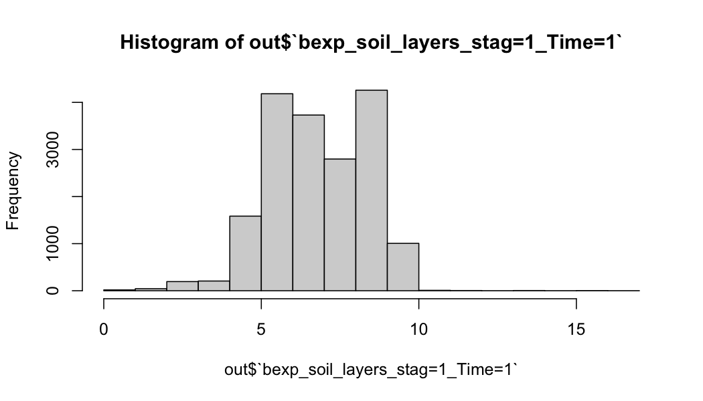

The purpose here is to demonstrate a real world application of `zonal` to summarize the NWM channel routing parmaters to a 
in-development hydrofabric.


```r
library(terra)
library(sf)
library(zonal)
library(paint)
```

### Define Aggregations Geometries and Geogrid

Here we are using a version of the `ngen` hydrofabric: 


```r
geom <- read_sf('/Users/mjohnson/github/hydroresolve/releases//beta/01a/hydrofabric.gpkg', "catchments")
paint(geom)
```

```
## sf [18041, 4] 
## active geometry column: geom (POLYGON)
## crs: 5070 (NAD83 / Conus Albers)
## crs unit: metre 
## ID        chr cat-1 cat-2 cat-4 cat-5 cat-6 cat-7
## area_sqkm dbl 12.457576 267.083595 8.319214 9.278138 60.577~
## toID      chr nex-2 nex-3 nex-5 nex-6 nex-7 nex-8
## geom      sfc POLY 2,024B POLY 9,064B POLY 1,656B POLY 1,81~
```

And the `soilproperties_CONUS_FullRouting` file from NWM v2.16. Can download from [here](https://www.nco.ncep.noaa.gov/pmb/codes/nwprod/nwm.v2.1.6/parm/domain/soilproperties_CONUS_FullRouting.nc)


```r
(f = rast('soilproperties_CONUS_FullRouting.nc'))
```

```
## [1] "vobjtovarid4: **** WARNING **** I was asked to get a varid for dimension named west_east BUT this dimension HAS NO DIMVAR! Code will probably fail at this point"
## [1] "vobjtovarid4: **** WARNING **** I was asked to get a varid for dimension named south_north BUT this dimension HAS NO DIMVAR! Code will probably fail at this point"
```

```
## class       : SpatRaster 
## dimensions  : 3840, 4608, 45  (nrow, ncol, nlyr)
## resolution  : 1, 1  (x, y)
## extent      : 0.5, 4608, 0.5, 3840  (xmin, xmax, ymin, ymax)
## coord. ref. : +proj=longlat +datum=WGS84 +no_defs 
## sources     : soilproperties_CONUS_FullRouting.nc:bexp  (4 layers) 
##               soilproperties_CONUS_FullRouting.nc:cwpvt  
##               soilproperties_CONUS_FullRouting.nc:dksat  (4 layers) 
##               ... and 15 more source(s)
## varnames    : bexp 
##               cwpvt 
##               dksat 
##               ...
## names       : bexp_~ime=1, bexp_~ime=1, bexp_~ime=1, bexp_~ime=1, cwpvt_Time=1, dksat~ime=1, ...
```

Note that when the layered attributes are separated, there are 45 raster layers. Also note that the spatial metadata for the NWM file is out of wack (see the resolution, extent, and CRS). We will fix this using some functionality from `wrfhydroSubsetter` to identify the layer structure.


```r
library(wrfhydroSubsetter)
e = make_empty_geogrid_raster('/Volumes/Transcend/nwmCONUS-v216/geo_em_CONUS.nc')
ext(f) = ext(e)
crs(f) = crs(e)
f
```

```
## class       : SpatRaster 
## dimensions  : 3840, 4608, 45  (nrow, ncol, nlyr)
## resolution  : 1000, 1000  (x, y)
## extent      : -2304000, 2304000, -1920001, 1919999  (xmin, xmax, ymin, ymax)
## coord. ref. : +proj=lcc +lat_0=40.0000076293945 +lon_0=-97 +lat_1=30 +lat_2=60 +x_0=0 +y_0=0 +R=6370000 +units=m +no_defs 
## sources     : soilproperties_CONUS_FullRouting.nc:bexp  (4 layers) 
##               soilproperties_CONUS_FullRouting.nc:cwpvt  
##               soilproperties_CONUS_FullRouting.nc:dksat  (4 layers) 
##               ... and 15 more source(s)
## varnames    : bexp 
##               cwpvt 
##               dksat 
##               ...
## names       : bexp_~ime=1, bexp_~ime=1, bexp_~ime=1, bexp_~ime=1, cwpvt_Time=1, dksat~ime=1, ...
```

### Build Weight Grid


```r
w_time = system.time({
  zonal_w = weighting_grid(file = f, geom = geom, ID = "ID")
})

paint(zonal_w)
```

```
## data.table [330755, 5] 
## keys: grid_id 
## ID      chr cat-72 cat-72 cat-72 cat-72 cat-72 cat-72
## Y       dbl 689 689 689 689 689 689
## X       dbl 4310 4311 4312 4313 4314 4315
## grid_id dbl 175 176 177 178 179 180
## w       dbl 0.407517 0.360609 0.203826 0.096122 0.22353 0.0~
```

### Execute Intersection


```r
z_time = system.time({
  out = zonal::execute_zonal(f, w = zonal_w)
})

names(out) = c('ID', names(f))

paint(out)
```

```
## data.table [18041, 46] 
## keys: ID 
## ID                               chr cat-1 cat-10 cat-100 c~
## bexp_soil_layers_stag=1_Time=1   dbl 8.282019 8.3008 4.4022~
## bexp_soil_layers_stag=2_Time=1   dbl 8.282019 8.3008 4.4022~
## bexp_soil_layers_stag=3_Time=1   dbl 8.282019 8.3008 4.4022~
## bexp_soil_layers_stag=4_Time=1   dbl 8.282019 8.3008 4.4022~
## cwpvt_Time=1                     dbl 0.358165 0.358331 0.35~
## dksat_soil_layers_stag=1_Time=1  dbl 0.000004 0.000004 0.00~
## dksat_soil_layers_stag=2_Time=1  dbl 0.000004 0.000004 0.00~
## dksat_soil_layers_stag=3_Time=1  dbl 0.000004 0.000004 0.00~
## dksat_soil_layers_stag=4_Time=1  dbl 0.000004 0.000004 0.00~
## dwsat_soil_layers_stag=1_Time=1  dbl 0.000023 0.000024 0.00~
## dwsat_soil_layers_stag=2_Time=1  dbl 0.000023 0.000024 0.00~
## dwsat_soil_layers_stag=3_Time=1  dbl 0.000023 0.000024 0.00~
## dwsat_soil_layers_stag=4_Time=1  dbl 0.000023 0.000024 0.00~
## hvt_Time=1                       dbl 16 19.315861 9.692179 ~
## mfsno_Time=1                     dbl 3.642424 3.735388 1.16~
## mp_Time=1                        dbl 12.393361 8.971084 9.9~
## psisat_soil_layers_stag=1_Time=1 dbl 0.716336 0.759 0.18949~
## psisat_soil_layers_stag=2_Time=1 dbl 0.716336 0.759 0.18949~
## psisat_soil_layers_stag=3_Time=1 dbl 0.716336 0.759 0.18949~
## psisat_soil_layers_stag=4_Time=1 dbl 0.716336 0.759 0.18949~
## quartz_soil_layers_stag=1_Time=1 dbl 0.265841 0.25 0.539492~
## quartz_soil_layers_stag=2_Time=1 dbl 0.265841 0.25 0.539492~
## quartz_soil_layers_stag=3_Time=1 dbl 0.265841 0.25 0.539492~
## quartz_soil_layers_stag=4_Time=1 dbl 0.265841 0.25 0.539492~
## refdk_Time=1                     dbl 0.000002 0.000002 0.00~
## refkdt_Time=1                    dbl 3.81326 3.861417 2.528~
## rsurfexp_Time=1                  dbl 1.191117 1.145731 2.40~
## slope_Time=1                     dbl 0.258123 0.267325 0.01~
## smcdry_soil_layers_stag=1_Time=1 dbl 0.082099 0.084 0.03394~
## smcdry_soil_layers_stag=2_Time=1 dbl 0.082099 0.084 0.03394~
## smcdry_soil_layers_stag=3_Time=1 dbl 0.082099 0.084 0.03394~
## smcdry_soil_layers_stag=4_Time=1 dbl 0.082099 0.084 0.03394~
## smcmax_soil_layers_stag=1_Time=1 dbl 0.454912 0.456694 0.69~
## smcmax_soil_layers_stag=2_Time=1 dbl 0.454912 0.456694 0.69~
## smcmax_soil_layers_stag=3_Time=1 dbl 0.454912 0.456694 0.69~
## smcmax_soil_layers_stag=4_Time=1 dbl 0.454912 0.456694 0.69~
## smcref_soil_layers_stag=1_Time=1 dbl 0.356726 0.36 0.191197~
## smcref_soil_layers_stag=2_Time=1 dbl 0.356726 0.36 0.191197~
## smcref_soil_layers_stag=3_Time=1 dbl 0.356726 0.36 0.191197~
## smcref_soil_layers_stag=4_Time=1 dbl 0.356726 0.36 0.191197~
## smcwlt_soil_layers_stag=1_Time=1 dbl 0.082099 0.084 0.03394~
## smcwlt_soil_layers_stag=2_Time=1 dbl 0.082099 0.084 0.03394~
## smcwlt_soil_layers_stag=3_Time=1 dbl 0.082099 0.084 0.03394~
## smcwlt_soil_layers_stag=4_Time=1 dbl 0.082099 0.084 0.03394~
## vcmx25_Time=1                    dbl 60.770485 51.91229 43.~
```

```r
hist(out$`bexp_soil_layers_stag=1_Time=1`)
```




```r
spat = merge(geom, out, by = "ID")

library(ggplot2)

plot(f[[1]])
```


```r
ggplot() + 
  geom_sf(data = spat, aes(fill = `bexp_soil_layers_stag=1_Time=1`), color = NA) + 
  scale_fill_viridis_c()
```


### Summary 


