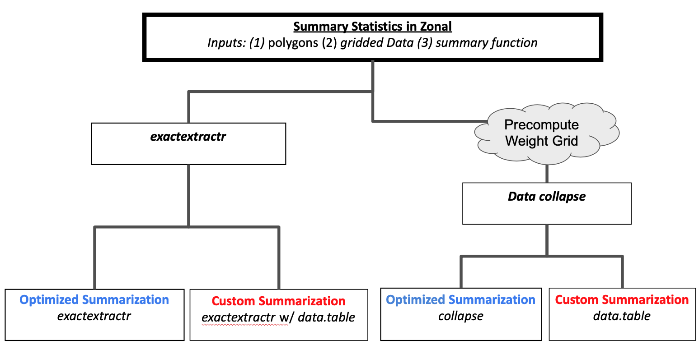

```{r, include = FALSE}
library(terra)

knitr::opts_chunk$set(
  out.width = "100%",
  fig.width = 7,
  fig.height = 4, dpi = 150, fig.path = "b-",
  message = FALSE, warning = FALSE, error = FALSE
)

devtools::load_all('.')
```

```{r}
library(doMC)
library(foreach)
library(ggplot2)
library(patchwork)
library(terra)
# library(zonal)
library(exactextractr)
```

# Scope

`zonal` is an extension package for `extactextractr` that adds utilities for increased speed for repeatative (distributed files) tasks, and use of custom user functions. The gist of `zonal` is that a portion of `exact_extract()`'s execution time is spent building weight grids. 

If a user wants to apply that same weight grid across many different datasets either due to size, or, because different functions are intended to summarize different layers, there is value in being able to precompute the weights and apply it over and over again.

When using a weight grid to summarize data rather then "on-the-fly" summarization, we can enlist a number of R-based tool chains for increased performance - namely   `data.table` and `collapse`.

The conceptual model that `zonal` uses is to provide a common syntax for 4 different use cases in shown below:

```{r concepts}

```

**NOTE**: The examples shown here are highlighting advances made for _some_ workflows. `zonal` _cannot_ exist without `exactextractr` and timing should not be taken as a package comparison! For many, many use cases, the far left path - straight  `exact_extract` - is used, unimpeeded by any `zonal` code outside the optional handling of pathnames for input `x`.

# Use Case 1 - Many files, not easy to merge

The use here is that we want to summarize daily mean rainfall for 21 years of gridded gridmet data. The gridmet team provides daily data in annual NetCDF files each containing 1 variable. If you wanted to compute a 21 year daily mean rainfall, you would need to download 21 files. For this test, we loaded these in the following directory:

```{r inputdata}
pr = list.files('/Volumes/Transcend/ngen/climate/gridmet/pr', full.names = TRUE)
```

In total these `r length(pr)` files take up `r sum(unlist(lapply(pr, file.size))) / 1e9` gigabytes, and store approximately `r prod(dim(rast(pr[1]))) * length(pr)` values. One slice of data can be seen below:

```{r}
plot(rast(pr[1])[[1]], main = "Rainfall 2000-01-01")
```


# Summary Units

For this use case, we are defining the summarization units as 17,695 watersheds spanning the east coast of the United States:

```{r}
# AOI
AOI = sf::read_sf('../../hyAggregate/data/03_ngen_01.gpkg', 'aggregate_catchments')

plot(sf::st_geometry(AOI))
```

# Precomute a Weighting Grid

The summary function of choice is `mean`. This function is an "optimized" function because both `exactextractr` and `collapse` provide explict `mean` functions. To illustrate the difference in the two routes shown in figure 1, we precompute a weight grid by calling `zonal::weight_grid`.

```{r, weight_grid}
weight_time = system.time({
  gw = weight_grid(pr[1], AOI, "id", progress = FALSE)
})

weight_time
```

Overall producing a weight_grid took `r weight_time[3]` seconds. The result is the `data.table` shown below:

```{r}
class(gw)
dim(gw)
head(gw)
```

For all options we will use the foreach iterator to work over the gridMet files with the `.combine = "cbind"` option. We will also use a `doMC` parallel backend. 

```{r}
registerDoMC()
```


## Route 1: Parralelized `exact_extract`

First we iterate over the `exact_extract` implementation: 
    
```{r ee}
ee_time = system.time({
  ee_exe = foreach(i = 1:length(pr), .combine = 'cbind') %dopar% {
    exact_extract(rast(pr[i]), 
                  AOI, 
                  fun = "mean",
                  progress = FALSE)
  }
  
  ee_exe$id = AOI$id
})

ee_time 

dim(ee_exe)
```

Overall, this process took `r ee_time[3]` seconds, and produced a data.table with `r dim(ee_exe)[1]` rows and `r dim(ee_exe)[2]` columns.

## Route 2: zonal wrapper

First we iterate over the `exact_extract` implementation: 
    
```{r ee}
zonal_time = system.time({
  zonal_exe = foreach(i = 1:length(pr), .combine = 'cbind') %dopar% {
    execute_zonal(pr[i], 
                  AOI, 
                  ID = "id",
                  drop = "id",
                  fun = "mean",
                  join = FALSE)
  }
  
  zonal_exe$id = AOI$id
})

zonal_time 

dim(zonal_exe)
```

Overall, this process took `r zonal_time[3]` seconds, and produced a data.table with `r dim(zonal_exe)[1]` rows and `r dim(zonal_exe)[2]` columns.


## Route 2: Using a weight grid

```{r zonal}
zonal_time_wg = system.time({
  zonal_exe_wg = foreach(i = 1:length(pr), .combine = 'cbind') %dopar% {
    execute_zonal(pr[i], 
                  w = gw, 
                  fun = "mean",
                  ID = "id", 
                  drop = "id")
  }
  
  zonal_exe$id = AOI$id
})

zonal_time_wg

dim(zonal_exe)
```

Overall, this process took `r zonal_time_wg[3]` seconds, and produced a data.table with `r dim(zonal_exe_wg)[1]` rows and `r dim(zonal_exe_wg)[2]` columns.

# Checks

First we ensure the outputs produce the same results across one time slice:

```{r equality_check}
{
  plot(sort(as.numeric(ee_exe[1,])), as.numeric(sort(zonal_exe_wg[1,])),
     cex = .5, pch = 16, xlab = "Sorted EE", ylab = "Sorted Zonal",
     main = "Across Time")
  abline(0,1, col = "red")
}
```

and across space:

```{r}
zonal_sf = merge(AOI, zonal_exe, by = "id")
ee_sf = merge(AOI, ee_exe, by = "id")

ggplot() + 
  geom_sf(data = zonal_sf, aes(color = `mean.precipitation_amount_day=36524`), border = FALSE) + 
  theme_light() +
  labs(color = "Zonal PPT") + 
  theme(legend.position = "bottom") + 
ggplot() + 
  geom_sf(data = ee_sf, aes(color = `mean.precipitation_amount_day=36524`), border = FALSE) +
  theme_light() +
  labs(color = "EE PPT") + 
  theme(legend.position = "bottom")
```

## Timing Comparision
```{r}
df = data.frame(type = c("weight_grid", "ee", "zonal", "zonal_with_wg", "zonal+weight_grid" ),
                time = c(weight_time[3], ee_time[3], zonal_time[3], zonal_time_wg[3], weight_time[3] + zonal_time_wg[3] )) |> 
  dplyr::mutate(savings = (time - ee_time[3]))
```

```{r}
ggplot(data = df) + 
  geom_col(aes(x = type, y = time)) +
  theme_light() + 
  labs(y = 'Time (seconds)', x = "Method", title = "Total Time") +
ggplot(data = dplyr::filter(df, !type %in% c('weight_grid', 'ee'))) + 
  geom_col(aes(x = type, y = savings)) + 
  theme_light() + 
  labs(y = '', x = 'Method', title = "Time Saved") 
```

## Timing is relative to process

As an extrapolation process, lets imagine we wanted to summarize 5 gridmet variables over the 21 year period.

```{r}
vars   = 5
years  = 21
Files  = years * vars
```

```{r}
###
time_per_file_ee = ee_time[3] / 21
time_per_file_zonal = zonal_time[3] / 21
df2 = data.frame(files = 1:Files,
  ee_time = c(1:Files) * time_per_file_ee,
           zonal_time = (c(1:Files) * time_per_file_zonal) + weight_time[3])

###
ggplot(data = df2) + 
  geom_line(aes(x = files, y = ee_time), color = "blue") + 
  geom_label(aes(x=118, y=tail(df2$ee_time, 1), 
                 label= paste("ExactExtract\n", round(tail(df2$ee_time, 1) / 60, 2), "minutes")), color="blue") +
  geom_line(aes(x = files, y = zonal_time), color = "red") +
  geom_label( aes(x=118, y=tail(df2$zonal_time, 1), 
                  label= paste("Zonal\n", round(tail(df2$zonal_time, 1) / 60, 2), "minutes")), color="red") +
  xlim(c(1,130)) +
  ylim(0,2000) + 
  theme_light() + 
  labs(title = "Estimate for 105 annual files: (~6GB, 38,325 layers, ~653 Billon Values)",
       x = "", y = "Time (seconds)") +

ggplot(data = df2) + 
  geom_line(aes(x = files, y = zonal_time / ee_time), color = "orange") + 
  geom_vline(xintercept = which.min(abs(df2$zonal_time - df2$ee_time)), lty = 2) +
  geom_hline(yintercept = 1, lty = 2) +
  geom_label(aes(x=18, y=6, 
                 label= paste(which.min(abs(df2$zonal_time - df2$ee_time)), "files" )), color="black") +
  geom_label(aes(x=-10, y=8, 
                 label= 100* round(head(df2$zonal_time / df2$ee_time, 1), 2)), color="orange") +
  geom_label(aes(x=19, y=1.75, 
                 label= 100* round(df2$zonal_time[8] / df2$ee_time[8], 2)), color="orange") +
  geom_label(aes(x=115, y=.6, 
                 label= paste0(100 * round(tail(df2$zonal_time / df2$ee_time, 1), 2) )), color="orange") +
  xlim(c(-15,130)) +
  ylim(c(0,9)) +
  theme_light() + 
  labs(title = "Where do strategies break even?", x = "Number of Files", y = "Time(zonal)/Time(exactextract)") &
  plot_layout(ncol = 1)
```


# Custom Functions

Both approaches take a serious hit when not using "optimized" `exactextract` or `collapse` functions. However the hit is much less dramatic when the weight grid is precomputed.


```{r}
ee_custom = system.time({
 exact_extract(x = rast(pr[1]), 
               y = AOI,
               fun = function(df){
                 prod(pmax(df$values, 0) + 1^df$coverage_fraction)^(1/sum(df$coverage_fraction)) - 1 },
               stack_apply =T,
               summarize_df = T)
})

ee_custom

zonal_custom = system.time({
  zonal_exe = execute_zonal(pr[1],
    w = gw,
    fun = geometric_mean,
    ID = "id")
})

zonal_custom
```

```{r}
df3 = data.frame(type = c("weight_grid", "ee_custom", "zonal_custom", "zonal_custom+wg" ),
                time = c(weight_time[3], 2078, zonal_custom[3], weight_time[3] + zonal_custom[3] ))


ggplot(data = df3) + 
  geom_col(aes(x = type, y = time)) +
  theme_light() + 
  labs(y = 'Time (seconds)', x = "Method", title = "Total Time") 

```


